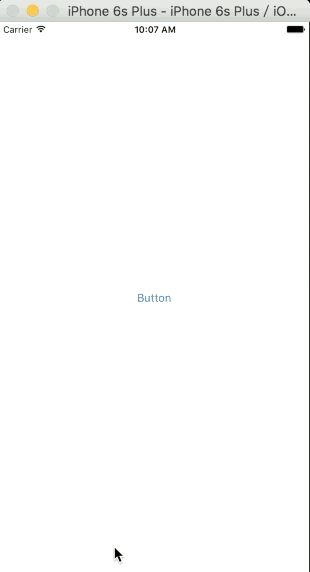

# JBImageBrowserViewController
JBImageBrowserViewController is a library enables a user to present images in fullscreen like twitter. Besides the typical pinch and double tap to zoom, we also provide a vertical swipe to dismiss. 

Thanks For [ImageViewer](https://github.com/MailOnline/ImageViewer), [Kingfisher](https://github.com/onevcat/Kingfisher) and [MWPhotoBrowser](https://github.com/mwaterfall/MWPhotoBrowser). I had reference with them.

<a href="http://cocoadocs.org/docsets/JBImageBrowserController"></a>



## Requirements

* iOS 8.0+
* Xcode 7.0 or above

##Usage

create some images 

```swift
let image_1 = JBImage(url: NSURL(string: "http://images.apple.com/cn/chinese-new-year/images/style_large_2x.jpg"))
let image_2 = JBImage(filePathURL: NSBundle.mainBundle().URLForResource("IMG_5445", withExtension: "JPG"))
let image_3 = JBImage(image: UIImage(named: "IMG_5429"))
let failedImage = UIImage(named: "error_place_image")
```
<br/>create an instance view controller for parsent images

```swift
let imageBrowserVC = JBImageBrowserViewController(imageArray: [image_1,image_2,image_3],failedPlaceholderImage:failedImage)
self.presentViewController(imageBrowserVC, animated: true, completion: nil)
```

## Installation

### CocoaPods

[CocoaPods](http://cocoapods.org) is a dependency manager for Cocoa projects. You can install it with the following command:

``` bash
$ gem install cocoapods
```

To integrate JBImageBrowserViewController into your Xcode project using CocoaPods, specify it in your `Podfile`:

``` ruby
source 'https://github.com/CocoaPods/Specs.git'
platform :ios, '8.0'
use_frameworks!

pod 'JBImageBrowserViewController'
```

Then, run the following command:

``` bash
$ pod install
```

You should open the `{Project}.xcworkspace` instead of the `{Project}.xcodeproj` after you installed anything from CocoaPods.

For more information about how to use CocoaPods, I suggest [this tutorial](http://www.raywenderlich.com/64546/introduction-to-cocoapods-2).